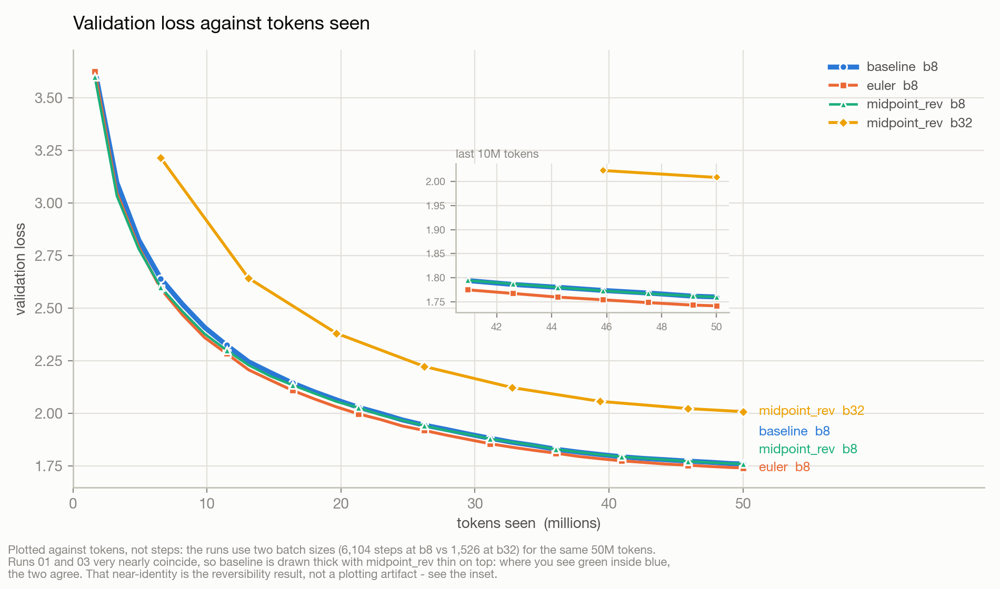
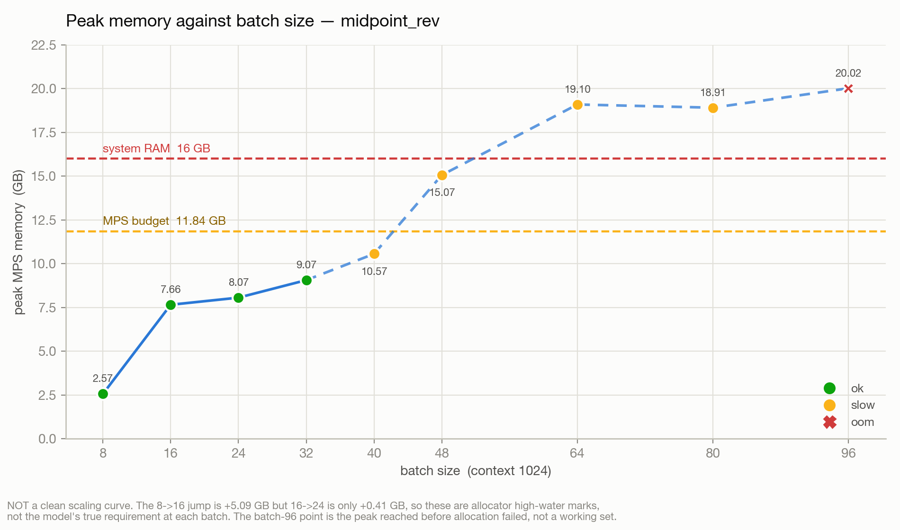
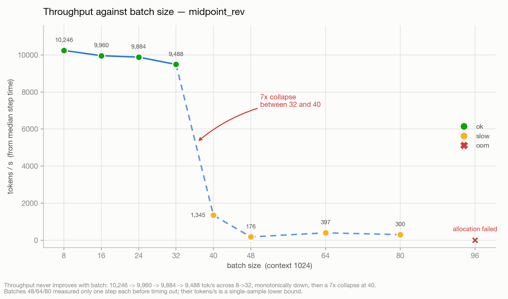

# Data pipeline — 20M-param LM on TinyStories

Data prep only. No model, training loop, or reversibility code lives here yet.

## What is in the repository

Code, logs, gate outputs and figures are tracked (~1.2 MB total). The dataset
and token files are **not** — `data/*.txt` and `data/*.bin` come to ~441 MB and
are ignored. Rebuild them in about two minutes:

```bash
python3 scripts/prepare_data.py     # re-downloads the 250 MB slice, rebuilds the .bin files
python3 scripts/verify_data.py      # confirms the counts and bytes-per-token
```

`data/tokenizer.json` **is** tracked (544 KB): retraining the BPE is not
guaranteed to reproduce a byte-identical vocabulary, and every token id in the
logs depends on it.

## Run order

```bash
# step 1 — data
python3 scripts/environment_check.py   # ~30s   confirm MPS + pick a dtype
python3 scripts/prepare_data.py        # ~2min  download, tokenise, write .bin
python3 scripts/verify_data.py         # ~30s   assert counts, read samples

# step 2 — model + reversibility
python3 scripts/model.py               # ~5s    param count for all 4 variants
python3 scripts/check_reversibility.py # ~40s   gate -> runs/reversibility_check.txt
python3 -u scripts/smoke_train.py      # ~5min  200 baseline steps, loss must fall

# step 3 — reversible backward
python3 -u scripts/check_gradients.py  # ~40s   gate -> runs/gradient_check.txt
python3 -u scripts/measure_memory.py   # ~60min scan -> runs/memory_scan.csv

# step 4 — the three comparable 50M-token runs (one at a time, fresh process each)
python3 -u scripts/train.py --variant baseline     --batch 8 --name 01_baseline_bs8
python3 -u scripts/train.py --variant euler        --batch 8 --name 02_euler_bs8
python3 -u scripts/train.py --variant midpoint_rev --batch 8 --name 03_midpoint_rev_bs8

# step 5 — clean throughput + batch ceiling (measurement only)
python3 -u scripts/measure_throughput.py  # ~5min  -> runs/throughput_clean.csv
python3 -u scripts/sweep_batch.py         # ~3h    -> runs/batch_sweep.csv

# step 6 — the maximum-batch run, then the report artifacts
python3 -u scripts/train.py --variant midpoint_rev --batch 32 --name 04_midpoint_rev_bs32
python3 -u scripts/make_report_data.py    # -> runs/summary.csv
python3 -u scripts/make_figures.py        # -> runs/figures/*.png
```

Use `python3 -u` for `smoke_train.py`; without it Python block-buffers stdout
and the per-step losses do not appear until the run ends.

`prepare_data.py` is idempotent: it reuses `data/TinyStories-train-250MB.txt` and
`data/tokenizer.json` if they already exist. Delete them to force a rebuild.

`verify_data.py --seed N` changes which random slices get printed.

## Layout

```
Reversibility/
  README.md
  scripts/  environment_check.py  prepare_data.py  verify_data.py
            model.py  check_reversibility.py  smoke_train.py
            reversible.py  check_gradients.py  measure_memory.py
            train.py  measure_throughput.py  sweep_batch.py
            make_report_data.py  make_figures.py
  data/     TinyStories-train-250MB.txt   tokenizer.json
            tokens.bin  train.bin  val.bin
  runs/     reversibility_check.txt  gradient_check.txt
            memory_scan.csv  throughput_clean.csv  batch_sweep.csv
            summary.csv  figures/
            01_baseline_bs8/  02_euler_bs8/  03_midpoint_rev_bs8/
            04_midpoint_rev_bs32/
              config.json  metrics.csv  val.csv
  experiments.csv
```

`data/` holds ~450 MB after a full run (250 MB of that is the raw text slice,
which you can delete once the `.bin` files exist). The `.bin` files are raw `uint16`, no
header — read them with `np.memmap`, never `np.load`:

```python
train = np.memmap("data/train.bin", dtype=np.uint16, mode="r")   # 49,500,000
val   = np.memmap("data/val.bin",   dtype=np.uint16, mode="r")   #    500,000
```

## Recorded results

Numbers below are from an actual run on 2026-09-25, not estimates.

### environment_check.py

| | |
|---|---|
| torch | 2.10.0 |
| python | 3.11.3 |
| platform | macOS-26.5.1-arm64 |
| chip | Apple M1 Pro |
| total RAM | 16.0 GB |
| `mps.is_available()` | True |
| fp32 50-step toy loop | PASS, final loss 8.9836 |
| bf16 autocast toy loop | PASS, final loss 8.9844 |
| **recommended dtype** | **`torch.autocast("mps", dtype=torch.bfloat16)`** |

bf16 autocast ran 50 steps with every loss finite, so there is no need to fall
back to fp32. Both loops sit near `ln(8192) = 9.011` as expected for random data
against an 8192-way head.

### prepare_data.py

Source: `huggingface.co/datasets/roneneldan/TinyStories`, `TinyStories-train.txt`.
Only the first 250 MB is fetched, via an HTTP `Range` header — the full 1.9 GB
file is never downloaded.

| | |
|---|---|
| raw slice | 262,144,000 bytes (250.0 MB) |
| complete documents in slice | 286,880 |
| documents consumed | 229,582 |
| text consumed | 199.3 MB |
| tokenizer | byte-level BPE, vocab 8192, trained in 13.3s |
| `<\|endoftext\|>` id | 0 |
| tokenisation | 50,000,222 tokens in 38.0s, trimmed to 50,000,000 |
| bytes per token | 4.180 (over the consumed text) |

The trailing story in the 250 MB slice is cut mid-sentence by the byte range, so
`prepare_data.py` truncates at the last `<|endoftext|>` and keeps only complete
documents. Each document is emitted followed by the `<|endoftext|>` id, so the
token stream carries story boundaries.

### verify_data.py

| file | tokens | bytes on disk |
|---|---|---|
| `data/tokens.bin` | 50,000,000 | 100,000,000 |
| `data/train.bin` | 49,500,000 | 99,000,000 |
| `data/val.bin` | 500,000 | 1,000,000 |
| `data/tokenizer.json` | — | 553,641 |

| | |
|---|---|
| vocab size | 8192 |
| dtype | uint16 |
| token id range | [0, 8191] |
| bytes per token | 4.151 (sampled: 8,301,223 bytes / 2,000,000 tokens) |
| assertions | all PASS |

`verify_data.py` also asserts `train.bin == tokens.bin[:49,500,000]` and
`val.bin == tokens.bin[49,500,000:]` element-wise, so the split is a true prefix
/ suffix and not a reshuffle. The val set is the *last* 500,000 tokens, held out
chronologically.

Two bytes-per-token figures appear because they are measured differently:
`prepare_data.py` divides consumed source text by tokens produced (4.180),
`verify_data.py` decodes 100 random 20,000-token windows and measures the result
(4.151). Both are well above the 3.3 floor, so vocab 8192 is large enough for
this text and no more raw data is needed.

## Why vocab 8192

At `d_model=512`, the embedding is `vocab x 512`, tied with the output head.
GPT-2's 50257 would be 25.7M parameters in the embedding alone — larger than the
whole 19.9M model. 8192 puts 4.2M there, about 21% of the budget.

## Model config these files are built for

vocab 8192, d_model 512, 5 layers, 8 heads, context 1024, tied embeddings,
dropout 0 — roughly 19.9M parameters, trained on exactly 50M tokens.

---

# Step 2 — model and reversibility

Model code only. No training loop, no reversible backward pass for gradients,
no logging infrastructure yet.

## The three variants

One `TransformerBlock` computes `f(x)`, the block update, with its layer norms
on the inside. Only the rule combining block outputs differs:

| variant | rule | reversible |
|---|---|---|
| baseline | `x = x + f(x)` | no |
| euler | `p[l+1] = p[l] + h*f(p[l])` | **no — see below** |
| midpoint | `p[l+1] = p[l-1] + 2h*f(p[l])` | yes |

`h = 0.25`, `blend = 0.5`. Neither was tuned.

Keeping the norms inside `f` is a refactor, not a different model: with
`f(x) = attn(ln1(x)) + mlp(ln2(x + attn(ln1(x))))`, the rule `x + f(x)` is
algebraically identical to the ordinary two-step pre-norm block.

**Midpoint layer 0** needs `p[-1]`, which does not exist. Layer 0 runs as an
ordinary residual block to manufacture the second state. That bootstrap is
never inverted — the backward walk recovers `p[0]` from layer 1's inverse — so
the choice does not affect reversibility, only the function the stack computes.

**Blend** is applied at the midpoint readout: `final = 0.5*p[L] + 0.5*p[L-1]`.
Leapfrog carries two weakly-coupled sub-streams (odd/even decoupling) and
blending the final pair is the standard fix. It costs nothing in
reversibility, since both states are held anyway. Unused for baseline and
euler, which have a single stream.

## Parameter count

| | |
|---|---|
| embedding + head (tied) | 4,194,304 |
| per transformer block | 3,152,384 |
| **total** | **19,957,248 (19.96M)** |
| identical across variants | yes |
| within [19.5M, 20.5M] | yes |

Positions are RoPE, which has no parameters. A learned 1024x512 table would add
524,288 and push the total to 20.48M; parameter-free positions land on the
19.9M in the spec.

Dropout is 0 by construction — no `nn.Dropout` module is created anywhere, so
the forward pass draws no random numbers and recomputing a block reproduces its
activations bit for bit. A nonzero mask would be resampled on recomputation and
the reconstruction would silently diverge.

## Reversibility gate

Full output in `runs/reversibility_check.txt`. Batch 8 x 1024 from `train.bin`,
device mps, chained reconstruction (each recovered state is built from the
previously recovered one, never from a stored ground truth, so errors compound
as they would in a real reversible backward pass).

| variant | dtype | max abs error | growing? | verdict |
|---|---|---|---|---|
| euler | fp32 | 6.531e-01 | no | **FAIL** |
| euler | bf16 | 6.554e-01 | no | — |
| midpoint | fp32 | **9.574e-07** | no | **PASS** |
| midpoint | bf16 | 1.263e-02 | no | — |

Midpoint per-layer, fp32: `p[3]` 1.192e-07, `p[2]` 5.960e-07, `p[1]` 7.972e-07,
`p[0]` 9.574e-07. Errors stay at fp32 rounding level and do not blow up on the
way down.

### Euler cannot be inverted exactly

`p[l+1] = p[l] + h*f(p[l])` rearranges to `p[l] = p[l+1] - h*f(p[l])` — `f` is
evaluated at the *unknown*. That is an implicit equation with no closed form.
An exact inverse would need a fixed-point or Newton solve per layer, which is
an iterative approximation with its own tolerance, not an inverse, and would
cost more forward evaluations than the activation memory it saves.

The check uses the naive explicit inverse `p_hat[l] = p[l+1] - h*f(p[l+1])`
and reports what it costs: error O(h^2) per layer, compounding to 6.5e-01.
No fixed-point iteration was added to force a pass, and `h` was left at 0.25
rather than shrunk — a smaller `h` shrinks the error without making the map
invertible.

### bf16 destroys the reconstruction

Midpoint in bf16 is **13,196x worse** than fp32 (1.263e-02 vs 9.574e-07). The
reconstruction subtracts two nearby numbers, and bf16's 8-bit mantissa has
nothing left after the cancellation. bf16 autocast trains fine here (step 1),
but **the reversible stack must run in fp32.**

## Smoke train

Baseline only, 200 steps, AdamW lr 3e-4, fp32.

| | |
|---|---|
| effective batch | 16 x 1024 (8 x 1024, accum 2) |
| tokens seen | 3,276,800 |
| first loss | 9.1828 (band [8.5, 9.5], `ln(8192)` = 9.011) |
| final loss | 3.9362 |
| mean last 20 steps | 3.9337 |
| wall clock | 287.5s (1.44s/step) |
| throughput | 11,398 tok/s |

Losses: 9.18 → 6.05 (step 20) → 5.03 (80) → 4.43 (120) → 3.94 (200).

### Why gradient accumulation

A single batch of 16 x 1024 falls off a memory cliff on this 16 GB M1 Pro:

| batch | warm s/step | throughput | MPS alloc |
|---|---|---|---|
| 16 x 1024 | 4.14 | 3,962 tok/s | 1.94 GB |
| 8 x 1024 | 0.62 | 13,308 tok/s | 0.92 GB |
| 4 x 1024 | 0.31 | 13,086 tok/s | 0.51 GB |

Batch 8 is 3.4x faster *per token*, so batch 16 is spilling rather than
compute-bound — halving the batch should roughly halve step time, not cut it to
a seventh. A literal batch-16 run also took 107s on its first step and had not
reached step 20 after 10 minutes. Running 8 x 1024 with accumulation 2 keeps
the effective batch at 16 and the optimiser arithmetic identical, at ~5 minutes
instead of an unpredictable 15-40. Measured on a machine whose swap was already
~26 GB deep from other applications, so the cliff may sit elsewhere when idle.

---

# Step 3 — reversible backward pass

`midpoint_rev` is the same arithmetic as `midpoint`, but its backward
reconstructs activations instead of storing them. Still no full training loop.

## How it works

`scripts/reversible.py` is a `torch.autograd.Function`. The forward saves
**only the final adjacent pair** `(p[L], p[L-1])` — no per-layer states. The
backward walks down, and at each layer one recomputation of `f_l(p[l])` serves
two jobs at once: it reconstructs `p[l-1] = p[l+1] - 2h*f_l(p[l])`, and it
provides the graph for that layer's vjp.

Layer `l` maps `(p[l-1], p[l]) -> p[l+1]`, so it feeds two upstream gradients:

```
dL/dp[l-1] += g[l+1]                       (identity path, exact)
dL/dp[l]   += 2h * vjp(f_l, p[l], g[l+1])  (through f)
```

Read the other way, `g[k]` only ever receives from layer `k` and layer `k+1`.
Walking down from `l = L-1`, layer `k+1` is always processed before layer `k`,
so `g[k]` is complete the moment layer `k` is done. That is what makes a single
downward sweep exact rather than approximate.

The bootstrap layer is never inverted (`p[0]` falls out of layer 1's inverse)
but it does carry gradient, through both its identity and its `f` path:
`dL/dp[0] += g[1] + vjp(f_0, p[0], g[1])`.

Cost: roughly 2x forward FLOPs instead of 1x, in exchange for dropping
per-layer activation storage.

**No reversible backward exists for euler**, deliberately. Step 2 showed its
inverse is implicit and its reconstruction error grows ~1.4x per layer; a
backward built on it would produce silently wrong gradients.

## Gradient gate

`runs/gradient_check.txt`. Both models built from the same SEED (max parameter
delta before the backward: 0.000e+00), one batch of 8 x 1024, fp32.

| | |
|---|---|
| loss, midpoint | 9.1995124817 |
| loss, midpoint_rev | 9.1995134354 |
| loss abs diff | 9.537e-07 |
| max abs grad diff | 2.533e-07 |
| **max rel grad diff** | **4.090e-06** (tol 1e-4) |
| worst tensor | `blocks.0.attn.qkv.weight` |
| tensors over tol | **0 of 63** |
| **GATE** | **PASS** |

Relative difference is `max|gA-gB| / max|gA|`, normalised by the tensor's
scale. An elementwise ratio explodes wherever `gA` has a near-zero entry —
which every gradient tensor has — and would say nothing about correctness.

The per-tensor spread is itself a check: blocks 1-4 differ by ~1e-7, block 0 by
~3e-6. Block 0's input is the most-reconstructed state, so it should carry the
most error, and it does.

## Memory scan

`runs/memory_scan.csv`. Each `(variant, batch)` ran in a **fresh subprocess** —
MPS caches allocations and `empty_cache()` does not reliably reset the driver,
so a peak measured after an earlier config in the same process reads high and
is not comparable. Peak sampled every 100 ms from
`torch.mps.driver_allocated_memory()`. MPS budget on this machine: **11.84 GB**.

Peak GB (`-` = did not complete 20 steps):

| variant | b8 | b16 | b32 | b64 |
|---|---|---|---|---|
| baseline | 5.32 | 9.57 | — | — |
| midpoint | 5.32 | 9.57 | — | — |
| midpoint_rev | **2.57** | **7.66** | **9.07** | — |

Where both completed:

| batch | midpoint | midpoint_rev | saving | speed |
|---|---|---|---|---|
| 8 | 5.32 GB | 2.57 GB | **51.8% less** | 1.25x slower |
| 16 | 9.57 GB | 7.66 GB | **20.0% less** | 1.00x (no measurable cost) |

**Largest batch that completed: baseline 16, midpoint 16, midpoint_rev 32.**
Reversibility buys one full doubling of batch size on this machine.

Timed-out configs still report a peak, because the poller checkpoints to disk
every second and the parent reads it after the kill. Those partial peaks are
the most direct evidence of why they failed — every one of them blew past the
11.84 GB budget into swap:

| config | partial peak | steps done |
|---|---|---|
| baseline b32 | 16.08 GB | 2/20 |
| midpoint b32 | 18.58 GB | 2/20 |
| midpoint_rev b64 | 19.44 GB | 2/20 |

### Caveats on these numbers

`midpoint` and `baseline` have identical peaks to 4 decimal places at b8 and
b16. That is expected — both store every activation, and midpoint's one extra
carried state is negligible against the per-block tensors.

The b8 saving (51.8%) is much larger than the b16 saving (20.0%). Activation
storage is what reversibility removes, but the logits tensor
(`B x 1024 x 8192 x 4` = 537 MB at b16, times three live copies for forward,
saved log-softmax, and gradient) is not touched by it and grows with batch. At
larger batch the head dominates the peak, so the fraction reversibility can
remove shrinks.

`midpoint_rev` at b32 fits (9.07 GB) but runs at only 1,434 tok/s against
~10,000 at b8/b16. It is close enough to the 11.84 GB budget to be partly
swapping. It completes, which the others do not, but it is not fast.

Throughput figures are noisy: this machine was under heavy memory pressure
from other applications throughout, and an isolated run of `baseline b8`
minutes before the scan measured 4,356 tok/s against the scan's 11,878. Treat
the *memory* columns as solid and the *tokens/s* columns as indicative.

## Growth check, tightened

The old rule (any single step growing more than 10x) was too loose to
discriminate — euler grows a steady ~1.4x per layer and was waved through as
"not growing", so only the magnitude check was doing any work.

The rule now clamps errors up to an **8-ULP floor** (dtype-aware: 2^-23 for
fp32, 2^-8 for bf16) and flags a run of **3 or more consecutive increases whose
total growth exceeds 3x**. Below the floor, "growth" is the float grid, not the
rule.

| variant | dtype | max err | longest run | verdict |
|---|---|---|---|---|
| euler | fp32 | 6.531e-01 | 4 increases, 4.57x | **GROWING** |
| euler | bf16 | 6.554e-01 | 4 increases, 4.60x | **GROWING** |
| midpoint | fp32 | 9.574e-07 | 1 increase, 1.00x | not growing |
| midpoint | bf16 | 1.263e-02 | none above floor | not growing |

Euler now fails on growth *and* magnitude. Midpoint still passes: 3 of its 4
fp32 errors sit at or below the 8-ULP floor (9.537e-07), and all 4 of its bf16
errors are below the bf16 floor (3.125e-02).

---

# Step 4 — three comparable 50M-token runs

Identical in everything except the variant: same seed, same data order, same
optimiser, same schedule. `scripts/train.py`, one run per process.

## Batch 8, not 16 — and why

The plan called for batch 16, chosen in step 3 as "the largest the baseline
reaches". **That step-3 conclusion was wrong for a full run.** The memory scan
measured only 20 steps per config; over thousands of steps batch 16 is not
sustainable on this 16 GB machine. Observed directly: 150 stable steps at
1.4 s/step, then the first validation pushed the MPS allocator cache from
9.58 GB to 10.08 GB, and the run collapsed to ~25 s/step and never recovered.
Projected ~21 h for one run.

Batch 8 was chosen for **all three runs equally**, preserving comparability.
6,104 steps instead of 3,052; same 50M tokens, same schedule shape.

## Token budget

50,000,000 is not divisible by 8 x 1024 = 8,192. Every run does 6,104 steps =
**50,003,968 tokens**, 3,968 over (0.008%), identically. The scripts record the
exact figure rather than claiming 50,000,000.

## Data order was actually held fixed

All three `config.json` files record the same first-batch token ids:

```
[263, 881, 14, 0, 431, 446, 259, 397, 12, 402]
```

## Results

| variant | final val (mean last 5) | best val | median s/step | peak GB | wall h | skew |
|---|---|---|---|---|---|---|
| baseline | 1.768609 | 1.759929 | 0.6392 | 5.57 | 5.70 | 5.3x |
| **euler** | **1.749236** | **1.741467** | 0.6514 | 5.57 | 3.33 | 3.0x |
| midpoint_rev | 1.768222 | 1.759779 | 0.8138 | 3.82 | 1.47 | 1.1x |

Validation curve (31 points each, every 200 steps, on the same fixed 327,680
held-out tokens):

| step | baseline | euler | midpoint_rev |
|---|---|---|---|
| 199 | 3.6321 | 3.6242 | 3.5980 |
| 1399 | 2.3238 | 2.2842 | 2.3003 |
| 2599 | 2.0291 | 1.9978 | 2.0277 |
| 3799 | 1.8820 | 1.8559 | 1.8794 |
| 4999 | 1.7939 | 1.7747 | 1.7943 |
| 6103 | **1.7599** | **1.7415** | **1.7598** |

### The headline: reversibility is free, in loss terms

`midpoint_rev` lands **0.000387 from baseline** (0.022%) after 50M tokens,
while using **31.5% less memory** (3.82 GB vs 5.57 GB). The reversible backward
reconstructs activations instead of storing them and the optimisation outcome
is indistinguishable -- which is what the step-3 gradient gate (4.090e-06 max
relative difference) predicted would happen, now confirmed end to end over a
full run rather than a single batch.

Cost: **1.27x more compute per step** (0.8138 s vs 0.6392 s median), the extra
forward pass per layer that the reconstruction requires.

### Euler wins on loss despite a broken inverse

Euler finished **0.0194 below baseline**, the best of the three, and led at
every single validation point. This is not a contradiction of step 2. Step 2
showed euler's *inverse* is wrong (implicit equation, ~1.4x error growth per
layer). Nothing about that prevents the forward map from being a good
integrator. Reconstruction quality and optimisation quality are separate
properties, and these runs separate them cleanly -- which is why euler was
included on loss trajectory rather than only on reconstruction.

Euler remains unusable for a reversible backward. It is a reason to be
interested in euler as a *forward* rule, not to revisit its invertibility.

### Do not read the wall-clock column as a variant property

Median step times are within 27% of each other, but wall clock ranges 1.47 h to
5.70 h. That spread is machine memory pressure, not the variants: run 1 spent
most of its life under ~18 GB of swap committed by other applications, run 3
ran on a quiet machine after Chrome was closed. The `skew` column (mean step
time / median step time) makes it visible -- 5.3x, 3.0x, 1.1x. A skew near 1.0
means a clean run.

The effect is dramatic and was measured live: closing Chrome mid-run took the
rate from 10.36 s/step to 0.72 s/step, a 14x speedup, within one validation
interval and with no restart.

**Use `median_step_time_s` for variant speed comparisons. Use `wall_s` only to
understand what the machine was doing.**

### Peak memory: 3.82 GB here vs 2.57 GB in the step-3 scan

Same variant, same batch. The training runs include validation passes, which
allocate beyond the training steady state. The step-3 scan did no validation.
Both numbers are correct for what they measured.

---

# Step 5 — clean throughput and the batch ceiling

Measurement only. No training, and **no batch size is recommended here** —
this is the evidence for that decision, not the decision.

## Part A — throughput at batch 8

200 steps per variant, first 50 discarded, fresh subprocess each, tokens/s
derived from the **median** step time. `runs/throughput_clean.csv`.

| variant | median_s | mean_s | p90_s | p99_s | mean/med | tok/s (median) | peak_gb |
|---|---|---|---|---|---|---|---|
| baseline | 0.6556 | 0.6684 | 0.6937 | 0.8326 | 1.020 | 12,496 | 5.32 |
| euler | 0.6437 | 0.6472 | 0.6902 | 0.6944 | 1.005 | 12,726 | 5.32 |
| midpoint_rev | 0.8007 | 0.8014 | 0.8036 | 0.8102 | 1.001 | 10,231 | 2.57 |

Every `mean/median` is ~1.00, so this is a clean measurement. Compare step 4,
where the same quantity was 5.26 / 3.02 / 1.07 — that spread measured swap
pressure, not the variants.

**midpoint_rev costs 1.22x per step** (0.8007 vs 0.6556 s) for **52% less
memory** (2.57 vs 5.32 GB). It is also the steadiest: its p99 sits 1.2% above
its median, against baseline's 27%. The variant that touches least memory has
the tightest tail — the same mechanism that wrecked step 4.

## Part B — batch sweep, midpoint_rev

50 steps per batch, first 10 discarded, fresh subprocess each.
`runs/batch_sweep.csv`.

| batch | status | peak_gb | median_s | mean_s | p90_s | mean/med | tok/s (median) | steps_50M | n |
|---|---|---|---|---|---|---|---|---|---|
| 8 | ok | 2.57 | 0.7995 | 0.8001 | 0.8023 | 1.001 | 10,246 | 6,104 | 40 |
| 16 | ok | 7.66 | 1.6450 | 1.6770 | 1.7400 | 1.019 | 9,960 | 3,052 | 40 |
| 24 | ok | 8.07 | 2.4864 | 2.5224 | 2.7028 | 1.014 | 9,884 | 2,035 | 40 |
| 32 | ok | 9.07 | 3.4537 | 3.4888 | 3.6433 | 1.010 | 9,488 | 1,526 | 40 |
| 40 | slow | 10.57 | 30.4481 | 146.4208 | 501.8892 | 4.809 | 1,345 | 1,221 | 16 |
| 48 | slow | 15.07 | 278.4974 | — | — | — | 176 | 1,018 | 1 |
| 64 | slow | 19.10 | 165.1409 | — | — | — | 397 | 763 | 1 |
| 80 | slow | 18.91 | 272.9018 | — | — | — | 300 | 611 | 1 |
| **96** | **oom** | **20.02** | — | — | — | — | — | 509 | 0 |

### Under-sampled rows

Batches 48, 64 and 80 completed **one step each** before the 900 s timeout.
With n=1, mean == median == p90 and `mean_over_median` is exactly 1.000 —
which reads as a perfectly quiet run and is the opposite of the truth. Those
dispersion statistics are suppressed (`—`) and the rows are excluded from the
quiet-batch analysis. `median_step_s` is kept: one measured step is still a
real duration, and at 165-278 s it is damning on its own.

`sweep_batch.py` now enforces this with a `MIN_SAMPLES = 10` guard.

### System state and swapping

| | |
|---|---|
| total system RAM | 16.00 GB |
| free RAM at sweep start | 3.28 GB |
| swap used at start / end | 15.39 GB / 19.42 GB |
| MPS budget (`recommended_max_memory`) | 11.84 GB |

**Swapping detected: YES.** Method: the `vm_stat` `Swapouts` counter was
sampled immediately before and after each batch's subprocess; a positive delta
means the kernel paged memory to disk while that batch ran.

| batch | swapouts delta | swap used delta |
|---|---|---|
| 8 | 0 | — |
| 16 | +120,984 | +0.90 GB |
| 24 | +134,884 | +0.51 GB |
| 32 | +511,836 | +1.11 GB |
| 40 | +10,444,663 | -1.04 GB |
| 48 | +8,589,551 | +3.24 GB |
| 64 | +9,851,027 | +0.43 GB |
| 80 | +12,444,688 | -4.72 GB |
| 96 | +3,720,929 | +3.68 GB |

Only batch 8 ran with zero swapouts. Batches 16-32 swapped modestly and their
`mean/med` stayed at ~1.01, so the swapping did not materially disturb them.
At batch 40 the counter jumps by a factor of 20 and the run falls apart.

### Required figures

- **largest batch with `mean_over_median` < 1.3: 32** (48/64/80 excluded as
  under-sampled)
- **highest `tokens_per_s_from_median`: batch 8, at 10,246 tok/s** (status ok)

### Shape of the curve

Throughput declines monotonically with batch size even in the healthy region —
10,246 -> 9,960 -> 9,884 -> 9,488 tok/s across batches 8 to 32. There is no
throughput gain to be had from a larger batch on this device; larger batches
buy fewer optimiser steps per epoch, not more tokens per second.

The cliff between 32 and 40 is sharp: peak crosses from 9.07 GB to 10.57 GB
against an 11.84 GB budget, `mean/med` goes 1.010 -> 4.809, and throughput
drops 7x. Allocation finally fails outright at batch 96, with a peak of
20.02 GB — almost exactly 1.7x the 11.84 GB budget, which is MPS's default
high-watermark multiplier. So the hard ceiling is set by the allocator's
watermark, while the *usable* ceiling is set much lower by the point at which
the working set stops fitting in physical RAM.

---

# Step 6 — the maximum-batch run

`04_midpoint_rev_bs32`: midpoint_rev at batch 32, the largest batch the sweep
found usable (mean/med 1.010, 9.07 GB peak). Same seed, same data order, same
schedule as runs 01-03; **the learning rate and warmup were not adjusted for
the larger batch**, deliberately, so the result isolates batch size.

## A bug fixed before launching

`train.py` sized the validation set from the training batch
(`VAL_BATCHES * batch * BLOCK_SIZE`). At batch 32 that is **655,360 tokens
against runs 01-03's 163,840** — and val.bin only holds 500,000, so it would
have wrapped and sampled overlapping regions. The final losses would not have
been comparable, which is the whole point of the run.

`VAL_TOKENS` is now frozen at 163,840 and does not depend on the batch.
Verified: the builder emits byte-identical micro-batches at batch 8 and batch
32 (same 40 offsets), so runs 01-03 are unaffected and run 04 matches them.

## Results — all four runs

`runs/summary.csv`. **tokens_per_s is the clean step-5 measurement, never a
training run's wall clock.**

| run | variant | batch | steps | final_val | tok/s | peak_gb | median_step_s | mean/med |
|---|---|---|---|---|---|---|---|---|
| 01_baseline_bs8 | baseline | 8 | 6,104 | 1.7686 | 12,496 | 5.57 | 0.6392 | 1.080 |
| 02_euler_bs8 | euler | 8 | 6,104 | **1.7492** | 12,726 | 5.57 | 0.6514 | 12.666 |
| 03_midpoint_rev_bs8 | midpoint_rev | 8 | 6,104 | 1.7682 | 10,231 | 3.82 | 0.8138 | 1.036 |
| 04_midpoint_rev_bs32 | midpoint_rev | 32 | 1,526 | 2.0870 | 9,488 | 9.32 | 3.5756 | 1.261 |

tokens_per_s sources — runs 01-03 from `throughput_clean.csv` (batch 8, 200
steps); run 04 from `batch_sweep.csv` (batch 32, 50 steps). None from a
training run's wall clock.

### Batch 32 is worse, exactly as predicted

Run 04 finished at **2.0870 against run 03's 1.7682 — 0.319 worse**, the same
model and the same 50M tokens. Both stated causes are visible and neither is
explained away:

- **1,526 optimiser steps against 6,104**, a quarter as many. The LR schedule
  was held fixed, so run 04 completed the same cosine decay in a quarter of
  the updates.
- **9,488 tok/s against 10,231**, because throughput falls with batch on this
  machine (step 5: 10,246 -> 9,960 -> 9,884 -> 9,488 across batches 8 to 32).

So the larger batch costs on both axes at once: fewer updates *and* fewer
tokens per second. It buys only headroom.

### mean_over_median, two ways

experiments.csv now carries `mean_over_median_metrics` (from each run's
metrics.csv, as specified) and `mean_over_median_wall`
(`(wall_s / steps) / median_step_time_s`). They disagree sharply, and the
disagreement is itself the finding:

| run | metrics (2% sample) | wall (every step) | tok/s as-run |
|---|---|---|---|
| 01_baseline_bs8 | 1.080 | **5.258** | 2,439 |
| 02_euler_bs8 | **12.666** | 3.019 | 4,196 |
| 03_midpoint_rev_bs8 | 1.036 | 1.069 | 9,673 |
| 04_midpoint_rev_bs32 | 1.261 | 3.633 | 2,509 |

metrics.csv logs every 50th step, so its ratio can **miss the stalls entirely**
(run 01: 1.08 sampled vs 5.26 actual) or be **dominated by a single caught
stall** (run 02: 12.67 sampled vs 3.02 actual). Only the wall column uses every
step. Run 03 is the one run where both agree — because it genuinely was clean.

## Figures

`runs/figures/`. Light-surface PNGs on the validated categorical palette
(slots 1-4). The validator reports a sub-3:1 contrast WARN for aqua and yellow,
so every series carries a direct label and a distinct marker shape as well as
a legend — identity is never colour alone.

### Figure 1 — validation loss against tokens seen



x: tokens seen (0-50M). y: validation loss. Four series, one per run. Runs 01
and 03 overlay (final losses differ by 0.000150); run 02 sits below them by
0.0185; run 04 sits above by 0.2487. Inset zooms the last 10M tokens.

### Figure 2 — peak memory against batch size



x: batch size (8-96). y: peak MPS memory (GB). Single series, points coloured
ok / slow / oom, with the 11.84 GB MPS budget and 16 GB system RAM marked.

### Figure 3 — throughput against batch size



x: batch size (8-96). y: tokens/s from median step time. Single series;
solid through batches 8-32, dashed 32-80, allocation failure at 96.

Three choices worth knowing:

- In fig 1, runs 01 and 03 coincide so closely that equal line widths hid one
  entirely. Baseline is drawn thick with midpoint_rev thin on top: **green
  inside blue means the two agree.** An inset zooms the last 10M tokens.
- In figs 2 and 3 the line is **solid only through the `ok` region and dashed
  past it**, so the thrashing points do not read as part of one smooth curve.
- Fig 2's caption states plainly that this is **not a clean scaling curve**:
  the 8->16 jump is +5.09 GB but 16->24 is only +0.41 GB, which is allocator
  high-water marks rather than the model's true requirement at each batch. The
  batch-96 point is the peak reached *before* allocation failed, not a working
  set.
